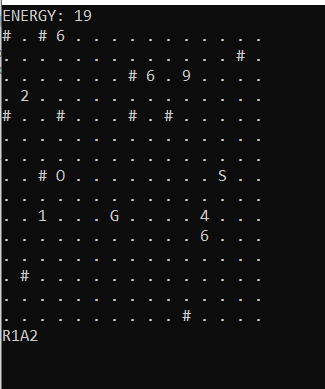

<h1>Mesh_chaos_s</h1>

Ethan is lost in a maze and has limited energy to move .Guide him through the grid so that he reaches his goal using his energy.

<h1>Installation Guide</h1>

The game has been written in python3. Download the python file from https://github.com/utkrisht-sikka/Mesh_chaos_s/blob/master/Mesh_chaos_s.py

For Windows users:
<ol>
<li>Open cmd.</li>
<li>Go to the directory where the file Mesh_chaos_s.py is present by using 
'cd c:'
'cd Users\<your username>\Downloads'</li>
<li>Run the app by using 
'python Mesh_chaos_s.py'</li>
<li> Enter a number .It will denote size of grid.</li>
</ol>
For linux users
<ol>
<li>Open terminal. </li>
<li>Go to the directory where the file Mesh_chaos_s.py is present by using 
'cd Downloads'</li>
<li>Run by using 
'python3 Mesh_chaos_s.py'</li>
<li> Enter a number .It will denote size of grid.</li>
</ol>

<h1>Contribution</h1>

I will welcome any kind of contribution like adding colours, background, sound effect, or any idea of extending storyline, adding more rules in the game.
Please create an issue and ask permission before working on it by writing in the comment. Once assigned, complete your work. Create a pull request citing the reference number in it.

#Note: The game was long ago given as an assignment in my college and I am 
intrigued to improve it further so that it can be a one of the best strategizing, graphic intensive game. 
